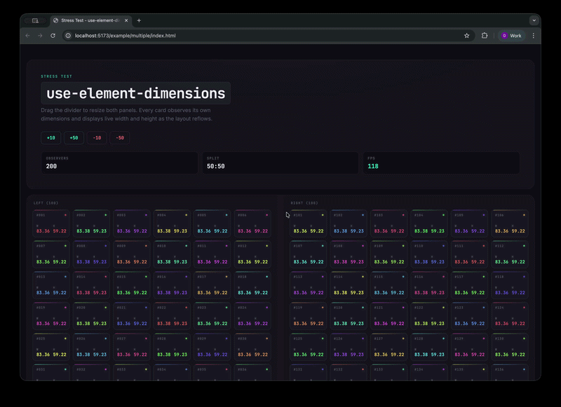

## `use-element-dimensions`  

React hook for observing DOM element dimensions with live updates.



### Usage

```jsx
import useDimensions, { useElementRect } from "use-element-dimensions";

const Example = () => {
  const [entry, dimensionsRef] = useDimensions();
  const [rect, rectRef] = useElementRect();

  return (
    <>
      <div ref={dimensionsRef}>
        Observer content box: {entry.contentRect.width} x {entry.contentRect.height}
      </div>
      <div ref={rectRef}>
        Bounding client rect: {rect.width} x {rect.height}
      </div>
    </>
  );
};
```

### Compatibility

- React `16.8+` through `19`
- Strict Mode / concurrent rendering safe via `useSyncExternalStore`
- Requires `ResizeObserver` in the runtime environment. If you need to support older browsers, include a polyfill.

### API

#### `useDimensions`

Returns the latest [`ResizeObserverEntry`](https://developer.mozilla.org/en-US/docs/Web/API/ResizeObserverEntry) for the attached element without remapping the observer payload. This is the lower-level, more performant hook because it avoids `getBoundingClientRect()` layout reads.

#### `borderBoxSize`

An object containing the new border box size of the observed element when the callback is run.

#### `contentBoxSize`

An object containing the new content box size of the observed element when the callback is run.

#### `contentRect`

A DOMRectReadOnly object containing the new size of the observed element when the callback is run. Note that this is better supported than the above two properties, but it is left over from an earlier implementation of the Resize Observer API, is still included in the spec for web compat reasons, and may be deprecated in future versions.

#### `target`

A reference to the Element or SVGElement being observed.

#### `useElementRect`

Returns the latest snapshot from `element.getBoundingClientRect()`. This preserves viewport-relative `x`, `y`, `top`, `left`, `right`, and `bottom`, but it performs a layout read when the observed element updates.

#### `x`

The x coordinate of the DOMRect's origin.

#### `y`

The y coordinate of the DOMRect's origin.

#### `width`

The width of the DOMRect.

#### `height`

The height of the DOMRect.

#### `top`

Returns the top coordinate value of the DOMRect (has the same value as y, or y + height if height is negative.)

#### `right`

Returns the right coordinate value of the DOMRect (has the same value as x + width, or x if width is negative.)

#### `bottom`

Returns the bottom coordinate value of the DOMRect (has the same value as y + height, or y if height is negative.)

#### `left`

Returns the left coordinate value of the DOMRect (has the same value as x, or x + width if width is negative.)

### Use case

There are already some hook libraries that provide dimensions on first render or even update them on `window` resize event, however in many cases this may not be sufficient. HTML DOM Elements can resize in response to a lot of things we don't expect, only one of which is screen size, for example:

- When animating any of the size properties.
- Setting a size properties on an encapsulating DOM Node.
- Orientation change (`resize` triggers in this case - or it should).

### Development

Everything in this package lives in `src/index.ts`. To work against an example app, install dependencies and run one of the Vite-powered example scripts:

- `npm run example:simple`
- `npm run example:multiple`
- `npm run example:test`

### Building

Run `npm run build` to build the three targets specified.

### Testing

Run `npm test` to execute the Vitest suite. The tests cover raw observer entries for `useDimensions`, `getBoundingClientRect()` snapshots for `useElementRect`, ref swaps, cleanup, and Strict Mode rendering.

### Examples

The examples live in the `example` directory. To run any of them, install dependencies and use one of the example scripts in `package.json`.
